# Template Security Execution Graph

```mermaid
graph TD
    A[Start: Over-Engineered System] --> B{Phase 1: 1% Effort → 51% Results}
    
    %% Phase 1: Core Security.md Foundation
    B --> C[SECURITY.md Template Enhancement]
    C --> D[Simple Validation System]
    D --> E[Project Detection Bug Fix]
    E --> F[Justfile Quick Commands]
    
    %% Phase 1 Success
    F --> G{Phase 1 Complete?}
    G -->|Yes| H{Phase 2: 4% Effort → 64% Results}
    G -->|No| I[Fix Issues]
    I --> C
    
    %% Phase 2: Integration & Automation
    H --> J[GitHub Integration]
    J --> K[CI/CD Validation Hook]
    K --> L[Template Variable System]
    L --> M[Error Handling Improvement]
    M --> N[CLI Help System]
    N --> O[Version Management]
    O --> P[Binary Distribution]
    P --> Q[Project Analysis System]
    Q --> R[Security Scoring]
    R --> S[GitHub Action Templates]
    S --> T[Policy Recommendation Engine]
    
    %% Phase 2 Success
    T --> U{Phase 2 Complete?}
    U -->|Yes| V{Phase 3: 20% Effort → 80% Results}
    U -->|No| W[Fix Issues]
    W --> J
    
    %% Phase 3: Advanced Features
    V --> X[Auto-completion]
    X --> Y[Configuration System]
    Y --> Z[Template Library]
    Z --> AA[Integration Examples]
    AA --> AB[Testing Framework]
    
    %% Additional Phase 3 Features
    AB --> AC[GitHub API Integration]
    AC --> AD[Security Dashboard]
    AD --> AE[Project Type Detection]
    AE --> AF[Security Notifications]
    AF --> AG[Security Templates]
    AG --> AH[Security Guidelines]
    AH --> AI[Security Community]
    AI --> AJ[Security Resources]
    AJ --> AK[Security Education]
    
    %% Final Success
    AK --> AL{Complete: 80% Value}
    AL -->|Success| AM[Focused SECURITY.md Generator]
    
    %% Risk Paths
    C --> AN{Risk: Over-Engineering}
    D --> AN
    E --> AN
    F --> AN
    
    AN --> AO[Stay Focused on 80/20]
    AO --> C
    
    %% Quality Gates
    G --> AP{Quality Gate: 51% Value}
    AP -->|Pass| H
    AP -->|Fail| I
    
    U --> AQ{Quality Gate: 64% Value}
    AQ -->|Pass| V
    AQ -->|Fail| W
    
    AL --> AR{Quality Gate: 80% Value}
    AR -->|Pass| AM
    AR -->|Fail| AT[Refine Implementation]
    AT --> X
    
    %% Impact/Effort Visualization
    subgraph "Impact vs Effort"
        BA[1% Effort → 51% Results]
        BB[4% Effort → 64% Results]
        BC[20% Effort → 80% Results]
        BD[100% Effort → 100% Results]
        
        BA --> BAVAL[51% Value, 15min tasks]
        BB --> BBVAL[64% Value, 30min tasks]
        BC --> BCVAL[80% Value, 45min tasks]
        BD --> BDVAL[100% Value, 60min+ tasks]
    end
    
    %% Success Metrics
    AM --> BM[Success Metrics]
    BM --> BN[✅ SECURITY.md Quality > 90%]
    BM --> BO[✅ Validation Accuracy > 90%]
    BM --> BP[✅ User Satisfaction > 85%]
    BM --> BQ[✅ Developer Experience > 80%]
    BM --> BR[✅ GitHub Integration > 95%]
```

## 🎯 Critical Success Factors

### ✅ Must Haves (Phase 1)
- **SECURITY.md Template**: GitHub best practices, proper sections, smart variables
- **Simple Validation**: Check for required sections, contact info, version info
- **Project Detection**: Accurate org/domain detection from multiple sources
- **Justfile Commands**: Quick shortcuts for common operations

### 🚀 Nice to Haves (Phase 2)
- **GitHub Integration**: Auto-detect repo info, suggest improvements
- **CI/CD Hooks**: Prevent broken SECURITY.md in PRs
- **Smart Variables**: Context-aware variable substitution
- **Better UX**: Helpful error messages, better help

### 🌟 Advanced Features (Phase 3)
- **Auto-completion**: Shell completion for CLI
- **Configuration**: .template-security.yaml config
- **Templates**: Industry-specific templates
- **Testing**: Automated policy validation

### ❌ Avoid (Over-Engineering)
- **Complex Compliance Engines**: GDPR, SOC2, ISO27001 metrics
- **Executive Reporting**: Risk assessments, action items
- **Enterprise Features**: Complex dashboards, analytics
- **Over-Complex Validation**: Excessive rules and scoring

## 🚨 Risk Mitigation

### Primary Risk: Scope Creep
- **Mitigation**: Strict 80/20 adherence
- **Check**: Each task must deliver high value for low effort

### Secondary Risk: Over-Engineering
- **Mitigation**: Focus on SECURITY.md only
- **Check**: Remove complex compliance systems

### Tertiary Risk: Feature Bloat
- **Mitigation**: Minimal viable features
- **Check**: Each feature must serve core use case

## 📊 Success Metrics by Phase

### Phase 1 (51% Value)
- **Template Quality**: 90%+ GitHub best practices coverage
- **Validation Accuracy**: 90%+ common issues caught
- **Detection Accuracy**: 80%+ project info detected correctly
- **Developer Experience**: Seamless justfile commands

### Phase 2 (64% Value)
- **GitHub Integration**: 95%+ repo auto-detection
- **CI/CD Effectiveness**: 100% broken SECURITY.md prevention
- **Variable System**: 90%+ use cases handled
- **Error Resolution**: 85%+ problems solved with messages

### Phase 3 (80% Value)
- **Auto-completion**: 95%+ command coverage
- **Configuration Success**: 90%+ user configs work
- **Template Library**: 80%+ industries covered
- **Integration Success**: 90%+ CI/CD systems supported

## 🎯 Final Goal

**Transform over-engineered compliance system into focused SECURITY.md generator that delivers maximum value with minimum complexity.**

**Success**: Simple, fast, reliable SECURITY.md generation and validation that just works for 95% of users.

**Failure**: Complex enterprise compliance system that nobody uses because it's over-engineered.