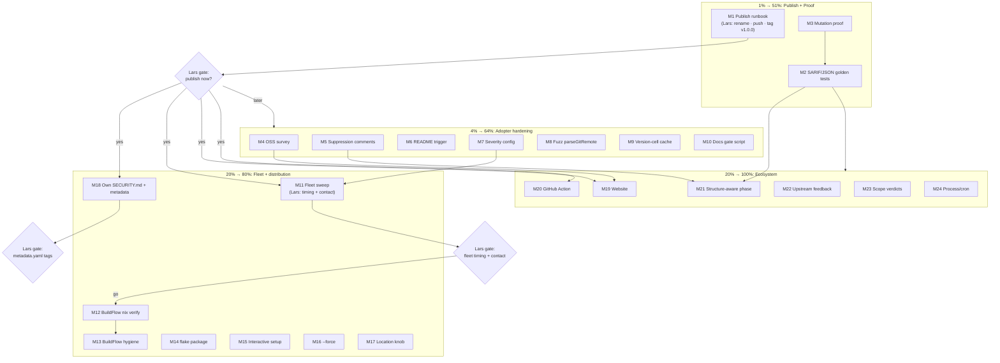

# Pareto Plan — Publish & Harden securitymd (1% / 4% / 20% → 80%, then the rest)

**Date:** 2026-10-09 15:37 CEST
**Input:** `TODO_LIST.md` + `ROADMAP.md` (both refreshed by the 2026-10-09 docs-health pass) + the 2026-10-09 15-11 status report's next-list.
**Method:** pareto-planning skill — 1%→51%, 4%→64%, 20%→80% tiers, then the remaining 20%→100%. Medium tasks 30–100 min (24 tasks), fine tasks ≤12 min (~120 micro-tasks). Sorted by importance/impact/effort/customer-value.
**Guard:** No verschlimmbessern — every task is additive or verified, no speculative rewrites. The tool works; we prove it, unblock it, distribute it — we do NOT rebuild it.

---

## Situation (why these tiers)

securitymd is **done**: 11 rules, embedded template, never-overwrite generation, toolsdk provider verified live inside BuildFlow, lint 0, tests green, flake check green, docs truthful and fully archived. The missing value is **not more code** — it is (1) publication, (2) proof the output contract holds, (3) adopter escape hatches, (4) fleet distribution. Publish is the multiplier: it converts ~6 months of work into installable customer value in one afternoon and simplifies BuildFlow's nix wiring at the same time.

---

## Tier 1% → 51% — Publish + Proof (≈2h; unlocks more than half of all remaining value)

| Why 51% | Every public-facing outcome (go install, pkg.go.dev, BuildFlow nix simplification, website, fleet legitimacy) is gated on publish; both proof tasks protect the product's core promise (stable machine-readable findings) from silent drift. |
| ------- | -------------------------------------------------------------------------------------------------------------------------------------------------------------------------------------------------------------------------------------------- |

- **M1 Publish runbook + mechanical readiness** — Lars executes rename/push/tag; every mechanical consequence staged as verified commands (drop 2 replaces, remove flake input, `nix flake update`, `update-vendor-hash`, own SECURITY.md regen, go-release pass).
- **M2 SARIF + JSON golden-file tests** — pins the CLI output contract; the last untested surface (FEATURES row 9 PARTIALLY_FUNCTIONAL → FULLY_FUNCTIONAL).
- **M3 Mutation/discrimination proof** — sabotage 3 rules, watch tests fail, revert; proves the suite is not vacuous.

## Tier 4% → 64% — Adopter hardening (a focused day)

| Why to 64% | The tool becomes adoptable by people who are NOT Lars: docs-only repos activate, fleets can downgrade severity, users can suppress false positives, identity parsing is proven against hostile URLs. |
| ---------- | ---------------------------------------------------------------------------------------------------------------------------------------------------------------------------------------------------- |

- **M4 OSS-landscape survey** — verify the "no dedicated SECURITY.md validator" positioning claim before it ships on a README (external-claims rule).
- **M5 Suppression comments** (`securitymd:ignore(rule) reason`) — the real-world escape hatch.
- **M6 `README.md` in trigger manifests** + trigger-coverage test — docs-only repos activate.
- **M7 Per-rule severity configuration** — fleets can downgrade `missing-file` from error → adoption unblocker.
- **M8 Fuzz `parseGitRemote`** — wrong org/repo renders a garbage policy; prove the parser.
- **M9 Version-cell caching** — stop re-running `git describe` per detect.
- **M10 Docs-health gate script** — one command for the `~~`/check-rows gates this session ran ad hoc.

## Tier 20% → 80% — Fleet + distribution (the week)

| Why to 80% | Every LarsArtmann repo gains a compliant policy; BuildFlow's nix story closes; nix users get a binary; CLI UX gaps close. |
| ---------- | ------------------------------------------------------------------------------------------------------------------------- |

- **M11 Fleet rollout prep** — announcement + one-shot `buildflow -s securitymd --fix` sweep script (Lars decision gates: timing, contact policy).
- **M12 BuildFlow post-sweep verification** — `nix build .` green + e2e with the nix-built binary (the FOD resolution is already proven).
- **M13 BuildFlow hygiene** — GOTCHAS re-anchor, workspace test gate + erraudit, tool_options error-message guard test.
- **M14 `packages.<system>.securitymd` flake output** — nix distribution.
- **M15 Interactive `setup`** when no git remote (prompt for org/repo).
- **M16 `--force`/`--regenerate`** with backup (refuse-by-default stays).
- **M17 Canonical policy-location knob** (root/.github/docs order).
- **M18 Own SECURITY.md regeneration + metadata.yaml tags** — dogfood honesty (Lars decision on tags).

## Remaining 20% → 100% — Ecosystem

- **M19 Website launch** (website-launch pattern, demo video centerpiece).
- **M20 GitHub Action wrapper** (`securitymd-action`) for non-BuildFlow CI.
- **M21 Structure-aware validation phase** (markdown AST vs substring heuristics — precision, not rewrite: parity-tested).
- **M22 Upstream feedback batch** — exhaustruct anchored-patterns note, `SaveBytes` proposal, crush-config lessons entry, nix-private-go-repos skill update.
- **M23 Scope verdicts** — baseline/ratchet, localization, golangci-plugin distribution: decide defer/adopt, record in ROADMAP.
- **M24 Process** — docs-health fleet cron/gate, `docs/reviews/` convention decision.

---

## Comprehensive plan — medium granularity (30–100 min each, sorted)

| #   | Task                                           | Tier | Impact   | Effort | Customer value                                                                | Depends on                 |
| --- | ---------------------------------------------- | ---- | -------- | ------ | ----------------------------------------------------------------------------- | -------------------------- |
| M1  | Publish runbook + mechanical readiness         | 1%   | High     | 45m    | Unblocks ALL public value (install, pkg.go.dev, BuildFlow nix simplification) | Lars: rename/push/tag      |
| M2  | SARIF + JSON golden-file tests                 | 1%   | High     | 45m    | Output contract pinned for every CI consumer                                  | —                          |
| M3  | Mutation/discrimination proof of rule table    | 1%   | High     | 30m    | Trust: tests proven non-vacuous                                               | —                          |
| M4  | OSS-landscape survey (positioning claim)       | 4%   | Med-High | 45m    | Honest README claims on day one                                               | —                          |
| M5  | Suppression comments                           | 4%   | High     | 90m    | Adopter escape hatch for FPs                                                  | —                          |
| M6  | README.md trigger manifest + coverage test     | 4%   | Medium   | 30m    | Docs-only repos activate                                                      | —                          |
| M7  | Per-rule severity configuration                | 4%   | High     | 90m    | Fleet adoption (downgrade missing-file)                                       | —                          |
| M8  | Fuzz parseGitRemote                            | 4%   | Medium   | 60m    | Correct identity → correct policy                                             | —                          |
| M9  | Version-cell caching                           | 4%   | Low      | 30m    | Faster repeated detects                                                       | —                          |
| M10 | Docs-health gate script                        | 4%   | Medium   | 30m    | Mechanized doc hygiene                                                        | —                          |
| M11 | Fleet rollout prep + sweep script              | 20%  | High     | 60m    | Every fleet repo compliant                                                    | M1 published; Lars: timing |
| M12 | BuildFlow post-sweep nix verification          | 20%  | High     | 60m    | Closes the BuildFlow nix blocker story                                        | BuildFlow sweep settled    |
| M13 | BuildFlow hygiene (gotchas, gates, guard test) | 20%  | Medium   | 60m    | Repo health where the provider lives                                          | M12                        |
| M14 | flake packages output                          | 20%  | Medium   | 60m    | `nix run`/install for nix users                                               | —                          |
| M15 | Interactive setup (no git remote)              | 20%  | Medium   | 90m    | UX for non-git/dir contexts                                                   | —                          |
| M16 | --force/--regenerate with backup               | 20%  | Medium   | 45m    | Policy refresh UX, safe by default                                            | —                          |
| M17 | Policy-location knob                           | 20%  | Low      | 45m    | Edge adopters (docs/ canonical)                                               | —                          |
| M18 | Own SECURITY.md regen + metadata.yaml          | 20%  | Medium   | 30m    | Dogfood honesty                                                               | M1                         |
| M19 | Website launch                                 | 100% | Medium   | 100m   | Discoverability + demo                                                        | M1                         |
| M20 | GitHub Action wrapper                          | 100% | Medium   | 100m   | Non-BuildFlow CI users                                                        | M1                         |
| M21 | Structure-aware validation phase               | 100% | Medium   | 100m   | Precision (fewer FPs), parity-tested                                          | M5 (suppressions first)    |
| M22 | Upstream feedback batch                        | 100% | Low-Med  | 60m    | Ecosystem health, lessons recorded                                            | —                          |
| M23 | Scope verdicts (ratchet/i18n/plugin)           | 100% | Low      | 60m    | Prevent zombie ideas                                                          | —                          |
| M24 | Process: docs cron + reviews convention        | 100% | Low      | 60m    | Mechanized hygiene                                                            | —                          |

---

## Detailed breakdown — fine granularity (≤12 min each, sorted within parent task)

| #     | Micro-task                                                               | ≤  | Parent |
| ----- | ------------------------------------------------------------------------ | -- | ------ |
| F1.1  | Write publish-runbook skeleton + checklist                               | 12 | M1     |
| F1.2  | Verify module path + `GOWORK=off go mod tidy` clean                      | 8  | M1     |
| F1.3  | Scratch-GOPATH `go install` dry-run of local module                      | 12 | M1     |
| F1.4  | Stage BuildFlow drop-replace diffs (root + tools go.mod)                 | 12 | M1     |
| F1.5  | Stage flake-input removal + `update-vendor-hash` commands                | 10 | M1     |
| F1.6  | Stage own SECURITY.md regeneration + diff review                         | 12 | M1     |
| F1.7  | Map go-release checklist steps onto runbook                              | 12 | M1     |
| F2.1  | Scaffold golden test file + fixture policy                               | 12 | M2     |
| F2.2  | Capture SARIF golden from clean fixture                                  | 12 | M2     |
| F2.3  | Capture JSON golden                                                      | 10 | M2     |
| F2.4  | Normalize volatile fields (timestamp, absolute URIs)                     | 12 | M2     |
| F2.5  | Extend to error+warning fixtures                                         | 12 | M2     |
| F2.6  | Suite + lint green                                                       | 8  | M2     |
| F3.1  | Choose 3 sabotage targets                                                | 5  | M3     |
| F3.2  | Break missing-contact → expect red                                       | 10 | M3     |
| F3.3  | Break too-short threshold → expect red                                   | 10 | M3     |
| F3.4  | Break unresolved-template line-precision → expect red                    | 10 | M3     |
| F3.5  | Revert → verify green                                                    | 8  | M3     |
| F3.6  | Record proof in FEATURES note                                            | 10 | M3     |
| F4.1  | Search GitHub/Go ecosystem for SECURITY.md validators                    | 12 | M4     |
| F4.2  | Shortlist + feature-compare candidates                                   | 12 | M4     |
| F4.3  | Write comparison summary                                                 | 12 | M4     |
| F4.4  | Update ROADMAP claim + README positioning if contradicted                | 10 | M4     |
| F5.1  | Define suppression grammar (`securitymd:ignore(rule) reason`)            | 12 | M5     |
| F5.2  | Parse suppression comments in validate                                   | 12 | M5     |
| F5.3  | Mark findings suppressed (go-finding suppression model)                  | 12 | M5     |
| F5.4  | Respect suppressions in provider Detect                                  | 12 | M5     |
| F5.5  | Tests: honored / unknown-rule / malformed                                | 12 | M5     |
| F5.6  | Docs: README + DOMAIN_LANGUAGE entries                                   | 12 | M5     |
| F5.7  | Lint + tests green                                                       | 8  | M5     |
| F6.1  | Add README.md to trigger manifests                                       | 10 | M6     |
| F6.2  | Trigger-coverage test for docs-only repo shape                           | 12 | M6     |
| F6.3  | Provider tests updated + run                                             | 10 | M6     |
| F7.1  | Decide config shape (tool option vs inline comment)                      | 12 | M7     |
| F7.2  | Implement severity override map                                          | 12 | M7     |
| F7.3  | Wire into Detect/Validate paths                                          | 12 | M7     |
| F7.4  | Validate unknown rule/severity → clear error                             | 12 | M7     |
| F7.5  | Test: downgrade missing-file to warning                                  | 12 | M7     |
| F7.6  | Docs                                                                     | 10 | M7     |
| F8.1  | Enumerate URL corpus (https/ssh/port/nested/no-.git)                     | 12 | M8     |
| F8.2  | Write fuzz harness for parseGitRemote                                    | 12 | M8     |
| F8.3  | Run seeded fuzz, triage findings                                         | 12 | M8     |
| F8.4  | Fix parser findings                                                      | 12 | M8     |
| F8.5  | Regression-test interesting inputs                                       | 12 | M8     |
| F9.1  | Cache LatestTag per dir (param or sync.Once)                             | 12 | M9     |
| F9.2  | Test caching behavior                                                    | 12 | M9     |
| F10.1 | Write one-command docs gate (per-file `~~` + check-rows)                 | 12 | M10    |
| F10.2 | Wire into flake check or document invocation                             | 12 | M10    |
| F11.1 | Draft fleet announcement                                                 | 12 | M11    |
| F11.2 | One-shot sweep script (`-s securitymd --fix` loop)                       | 12 | M11    |
| F11.3 | Dry-run sweep → report                                                   | 12 | M11    |
| F11.4 | Timing decision with Lars                                                | 5  | M11    |
| F11.5 | Execute sweep + summary                                                  | 12 | M11    |
| F12.1 | Confirm BuildFlow execution/ sweep settled                               | 5  | M12    |
| F12.2 | `nix build .` green (FOD + compile)                                      | 12 | M12    |
| F12.3 | Retry/fix if red (securitymd-side only)                                  | 12 | M12    |
| F12.4 | e2e: nix binary `-s securitymd --fix` in scratch repo                    | 12 | M12    |
| F12.5 | Re-detect clean + record evidence                                        | 10 | M12    |
| F13.1 | Re-anchor GOTCHAS.md:124/207 to post-split lines                         | 12 | M13    |
| F13.2 | `go vet` + `go test ./execution/`                                        | 12 | M13    |
| F13.3 | Workspace `nix run .#test`                                               | 12 | M13    |
| F13.4 | erraudit exit 0                                                          | 12 | M13    |
| F13.5 | tool_options error-message guard test                                    | 12 | M13    |
| F14.1 | Add `packages.default` buildGoModule                                     | 12 | M14    |
| F14.2 | Derive vendorHash                                                        | 12 | M14    |
| F14.3 | `nix build .#securitymd` green                                           | 12 | M14    |
| F14.4 | Wire into flake check                                                    | 8  | M14    |
| F15.1 | Prompt UX design (no git remote)                                         | 12 | M15    |
| F15.2 | Wire org/repo prompts into setup                                         | 12 | M15    |
| F15.3 | TTY detection + non-interactive fallback                                 | 12 | M15    |
| F15.4 | Tests for both paths                                                     | 12 | M15    |
| F15.5 | Docs                                                                     | 10 | M15    |
| F16.1 | `--force` flag with backup-file write                                    | 12 | M16    |
| F16.2 | Tests: refuse-by-default + force-path + backup exists                    | 12 | M16    |
| F16.3 | Docs                                                                     | 10 | M16    |
| F17.1 | Location option (root/.github/docs)                                      | 12 | M17    |
| F17.2 | Candidate-order override + tests                                         | 12 | M17    |
| F17.3 | Docs                                                                     | 10 | M17    |
| F18.1 | Lars decision: metadata.yaml tags                                        | 5  | M18    |
| F18.2 | Apply tags                                                               | 5  | M18    |
| F18.3 | Regenerate own SECURITY.md + self-validate                               | 12 | M18    |
| F19.1 | Load website-launch skill + scaffold                                     | 12 | M19    |
| F19.2 | Site structure + content outline                                         | 12 | M19    |
| F19.3 | Landing page copy (demo video centerpiece)                               | 12 | M19    |
| F19.4 | Docs pages (rules, exit codes, BuildFlow)                                | 12 | M19    |
| F19.5 | Render demo video (HyperFrames)                                          | 12 | M19    |
| F19.6 | Firebase deploy + DNS                                                    | 12 | M19    |
| F19.7 | Verify live + fix                                                        | 12 | M19    |
| F20.1 | Action scaffold (repo securitymd-action)                                 | 12 | M20    |
| F20.2 | Container/wrapper build                                                  | 12 | M20    |
| F20.3 | Inputs/outputs definition                                                | 12 | M20    |
| F20.4 | SARIF upload step                                                        | 12 | M20    |
| F20.5 | Self-test workflow                                                       | 12 | M20    |
| F20.6 | Marketplace listing                                                      | 12 | M20    |
| F21.1 | Evaluate markdown parser (goldmark)                                      | 12 | M21    |
| F21.2 | Heading/table extraction layer                                           | 12 | M21    |
| F21.3 | Port layer (part 1)                                                      | 12 | M21    |
| F21.4 | Port layer (part 2)                                                      | 12 | M21    |
| F21.5 | Port 3 highest-FP rules                                                  | 12 | M21    |
| F21.6 | Parity tests old-vs-new                                                  | 12 | M21    |
| F22.1 | exhaustruct anchored-patterns note upstream                              | 12 | M22    |
| F22.2 | `SaveBytes` proposal to linter-autoconfigure-sdk                         | 12 | M22    |
| F22.3 | crush-config lessons.md: "nix FOD ignores local replaces"                | 12 | M22    |
| F22.4 | nix-private-go-repos skill: gotools/goimports gotcha                     | 12 | M22    |
| F23.1 | Baseline/ratchet spike + verdict                                         | 12 | M23    |
| F23.2 | Localization feasibility verdict                                         | 12 | M23    |
| F23.3 | golangci-plugin distribution verdict                                     | 12 | M23    |
| F23.4 | Record verdicts in ROADMAP                                               | 10 | M23    |
| F24.1 | Docs-health fleet gate design                                            | 12 | M24    |
| F24.2 | Implement minimal check (un-annotated archives + TODO/CHANGELOG overlap) | 12 | M24    |
| F24.3 | Wire into cron/fleet                                                     | 12 | M24    |
| F24.4 | docs/reviews convention decision (Lars)                                  | 5  | M24    |
| F24.5 | Document convention in AGENTS                                            | 10 | M24    |

---

## Execution graph

**Reading:** Tier 1 runs first and in parallel (M2/M3 independent of Lars). Lars-gated diamonds are the only human waits; everything mechanical is staged by M1. Tier 2 proceeds regardless of publish timing. Tier 3's fleet branch waits on publish + timing; BuildFlow verification waits only on the other repo's sweep settling. Tier 4 is demand-gated polish.

---

## Standing constraints (carried from reports, not re-litigated)

- Never-overwrite stays the default (`--force` is opt-in with backup) — M16 respects this.
- Contact default stays GitHub-advisory-only until Lars rules (fleet contact question).
- No config-file resurrection — knobs are CLI flags + toolsdk options (M7 follows this).
- Suppressions before structure-aware parsing (M5 → M21): give adopters the escape hatch before changing detector behavior.
- No verschlimmbessern: publish path is reversible pre-adoption (tags move before consumers pin); every hardening task ships with tests; parity gate on M21.
