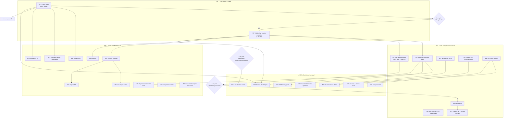

# Pareto Plan — Post-Publish: Prove, Distribute, Harden securitymd (1% / 4% / 20% → 80%, then 100%)

**Date:** 2026-10-09 20:32 CEST
**Input:** `TODO_LIST.md` (refreshed 2026-10-09 late evening) + `ROADMAP.md` + the 2026-10-09 20:19 status report's next-list + this session's verified state.
**Method:** pareto-planning skill — 1%→51%, 4%→64%, 20%→80% tiers, then the remaining 20%→100%. Medium tasks 30–100 min (27 tasks), fine tasks ≤12 min (125 micro-tasks). Sorted by importance/impact/effort/customer-value.
**Guard:** No verschlimmbessern — every task is additive or verified, no speculative rewrites. The tool is **published and green** (v1.0.0, all gates ✅); we PROVE it on real infrastructure, UNBLOCK its distribution, and DISTRIBUTE it — we do NOT rebuild it.

---

## Situation (why these tiers)

securitymd is shipped: v1.0.0 tagged, docs healthy and archived, all gates green, BuildFlow integration verified E2E. The missing value is **not more code** — it is (1) **proof on real infrastructure** (the CI workflow has never executed a step; the repo is private so install/pkg.go.dev don't resolve), (2) **the BuildFlow consumer switch**, (3) **the fleet rollout**, (4) **the post-publish distribution chain** (release workflow, GitHub Action, website, nixpkgs, Dependabot), (5) a **hardening backlog** that protects the now-public output contract, (6) **BuildFlow-side hygiene**. One human click (visibility flip) plus one account fix (Actions billing) convert most of the stored value — everything else is robot work.

---

## Tier 1% → 51% — Proof + Public (the multiplier)

| Why 51% | Every public-facing outcome (go install, pkg.go.dev, BuildFlow tag resolution, Action, website, fleet legitimacy) is gated on two human actions: Actions billing + visibility flip. One real runner run then proves the entire hardened CI story that three sessions built but never saw execute. |
| ------- | ------------------------------------------------------------------------------------------------------------------------------------------------------------------------------------------------------------------------------------------------------------------------------------------------- |

- **M1 CI proof chain** — billing fix (Lars), trigger `workflow_dispatch`, watch all four hardened steps on the real runner, fix the surprises that first runs always carry.
- **M2 Visibility flip + public resolution** — flip (Lars), then prove proxy/pkg.go.dev/install from the CONSUMER side and update FEATURES/README/TODO_LIST.

## Tier 4% → 64% — Adopter infrastructure (switch + fleet + contract-proofing)

| Why to 64% | The tag exists; BuildFlow still consumes via local replace. Dropping the scaffolding closes the story; the announcement+sweep makes every fleet repo compliant BEFORE the error-severity default lands; three hardening tasks (fuzz×2, JSON golden) protect the now-public output contract from day one. |
| ---------- | -------------------------------------------------------------------------------------------------------------------------------------------------------------------------------------------------------------------------------------------------------------------------------------------------------- |

- **M3 BuildFlow consumer switch** — drop both replaces, `go get @v1.0.0`, flake update + vendor-hash, `nix build .`, e2e with the built binary.
- **M4 docs-gate red-run proof + manifest-coverage leg** — the third-time lesson, mechanized: demonstrate the gate failing, then make it also require a manifest row per archived file.
- **M5 Fleet announcement finalized + sent** — placeholders, `.bak` guidance, failing-repo count (Lars timing).
- **M6 Fleet sweep executed** — dry-run → real `--fix` pass → repair summary → triage.
- **M7 CI default flip + escape-hatch verification** — flip the provider default in BuildFlow; prove suppression / expiry / severity-override escape hatches on a real repo each.
- **M8 Fuzz the severity-override parser** — corpus, harness, triage, regressions (same discipline as `FuzzParseGitRemote`).
- **M9 Property fuzz over `GenerateOptions`** — a generated policy never contains `{{`.
- **M10 CLI JSON golden expansion** — stdout+exit combos beyond the single pinned scenario.

## Tier 20% → 80% — Distribution + UX + quality gates (the week)

| Why to 80% | Public repos need a release workflow, an installable Action, a website, and OS packaging; public CI needs coverage/lint gates that can't silently rot; Windows users need a proven leg; the CLI surface gaps (completions, man, pre-commit recipe) are cheap adopter UX. |
| ---------- | ------------------------------------------------------------------------------------------------------------------------------------------------------------------------------------------------------------------------------------------------------------------------ |

- **M11 Windows CI leg** — matrix job, `.bak` timestamp + path-separator audit, green run.
- **M12 Release workflow** — GoReleaser vs flake-based decision, config, dry-run, practice cut, artifact verification.
- **M13 `securitymd-action`** — scaffold, inputs/outputs, SARIF upload, self-test workflow, marketplace listing.
- **M14 Website launch** — website-launch pattern, demo video centerpiece, Firebase deploy.
- **M15 nixpkgs PR** — derivation from the flake, PR text, submit.
- **M16 Dependabot/renovate for fleet repos** — choose, roll out, verify first run.
- **M17 Coverage ratchet + gosec overlap audit** — per-package floors (repo-total hides `cmd/` at 77.6%), CI wiring, one-off gosec/govulncheck overlap check.
- **M18 golangci-lint CI leg** — verified action SHA, `cmd/` lint-exclusion decision first, green run.
- **M19 Completions + man pages** — cobra built-ins + install docs.
- **M20 README: pre-commit recipe + config-free claim verification** — verify before advertising.

## Remaining 20% → 100% — Decisions, hygiene, long tail

- **M21 Lars decision batch + application** — metadata.yaml tags, `docs/reviews/` convention, fleet contact policy: decide, apply, document.
- **M22 Annotate + archive the 18:15 report** — once its P0s (M1–M3) resolve; keeps docs-status upkeep honest.
- **M23 BuildFlow hygiene batch** — gotcha re-anchor, suppression defense-in-depth in their gate, guard test #34, standing `docs --check`.
- **M24 docs-health asset upstream batch** — heading-mode annotator, `--pair` spec builder, tilde-exception documentation (all three earned this session).
- **M25 Structure-aware validation phase** — goldmark port, parity-gated, kills the substring-suppression footgun.
- **M26 CLI surface: `list-rules` + `report --since`** — machine-readable rule metadata; SARIF diff ratchet.
- **M27 Long-tail execution + verdicts batch** — version stamp, benchmarks, sweep `--json`/CRLF, resolver-column refactor, org-inheritance + SARIF-automationDetails verdicts, concurrent-session protocol proposal, crush-config checklist decision doc.

---

## Comprehensive plan — medium granularity (30–100 min each, sorted)

| #   | Task                                        | Tier | Impact   | Effort | Customer value                                                    | Depends on                |
| --- | ------------------------------------------- | ---- | -------- | ------ | ----------------------------------------------------------------- | ------------------------- |
| M1  | CI proof chain (billing → runner run → fix) | 1%   | High     | 60m    | The CI story becomes TRUE instead of locally-verified             | Lars: billing             |
| M2  | Visibility flip + public resolution         | 1%   | High     | 30m    | `go install …@v1.0.0` + pkg.go.dev resolve; PUBLIC                | M1 (push triggers CI)     |
| M3  | BuildFlow consumer switch                   | 4%   | High     | 60m    | Fleet tool consumes the tag; no local-path coupling               | M2                        |
| M4  | docs-gate red-run + manifest leg            | 4%   | Medium   | 30m    | Doc integrity gate provably non-vacuous + classification-complete | —                         |
| M5  | Fleet announcement final + send             | 4%   | High     | 30m    | No surprise breakage when the error gate lands                    | M2; Lars: timing          |
| M6  | Fleet sweep executed                        | 4%   | High     | 60m    | Every fleet repo compliant before the default flips               | M5                        |
| M7  | CI default flip + escape-hatch verification | 4%   | High     | 30m    | The gate is live AND its escape hatches proven per-repo           | M6                        |
| M8  | Fuzz severity-override parser               | 4%   | Med-High | 45m    | Public flag input proven against hostile input                    | —                         |
| M9  | Property fuzz GenerateOptions               | 4%   | Medium   | 30m    | Generated output contract machine-proven                          | —                         |
| M10 | CLI JSON golden expansion                   | 4%   | Medium   | 45m    | CI authors can pin stdout+exit behavior                           | —                         |
| M11 | Windows CI leg                              | 20%  | Medium   | 45m    | Windows contributors/users proven, not assumed                    | M1 (running CI)           |
| M12 | Release workflow                            | 20%  | High     | 60m    | Repeatable public releases, not hand-cut tags                     | M2                        |
| M13 | securitymd-action                           | 20%  | High     | 100m   | Non-BuildFlow consumers get one-line CI adoption                  | M2, M12                   |
| M14 | Website launch                              | 20%  | Med-High | 100m   | Discoverability + demo                                            | M2; M4 (survey freshness) |
| M15 | nixpkgs PR                                  | 20%  | Medium   | 60m    | `nixpkgs` users install without the flake                         | M12                       |
| M16 | Dependabot/renovate fleet                   | 20%  | Medium   | 45m    | Fleet repos track securitymd releases automatically               | M3                        |
| M17 | Coverage ratchet + gosec audit              | 20%  | Medium   | 60m    | cmd/ decay becomes visible; no vuln-coverage gap                  | M1                        |
| M18 | golangci CI leg                             | 20%  | Medium   | 45m    | The 0-issue bar enforced on every push                            | M1                        |
| M19 | Completions + man pages                     | 20%  | Low-Med  | 45m    | Shell-native UX                                                   | —                         |
| M20 | Pre-commit recipe + config-free claim       | 20%  | Low-Med  | 30m    | Honest README claims; commit-time validation recipe               | —                         |
| M21 | Lars decision batch + application           | 100% | Medium   | 30m    | Three open decisions closed, relics updated                       | Lars                      |
| M22 | Annotate + archive 18:15 report             | 100% | Low-Med  | 30m    | docs/status/ returns to one-live-snapshot discipline              | M1–M3                     |
| M23 | BuildFlow hygiene batch                     | 100% | Medium   | 60m    | Provider host stays healthy; defense in depth for every tool      | M3                        |
| M24 | docs-health asset upstream batch            | 100% | Low-Med  | 60m    | Fleet-wide doc hygiene gets cheaper (this session's lessons)      | —                         |
| M25 | Structure-aware validation phase            | 100% | Med-High | 100m   | Precision (fewer FPs); kills the substring-suppression footgun    | M8–M10 settle behavior    |
| M26 | CLI surface: list-rules + report --since    | 100% | Low-Med  | 60m    | CI config UIs + stateless ratcheting                              | M10                       |
| M27 | Long-tail execution + verdicts batch        | 100% | Low      | 100m   | Polish + zombie-idea prevention + process proposals               | —                         |

---

## Detailed breakdown — fine granularity (≤12 min each, sorted within parent task)

| #     | Micro-task                                                           | ≤  | Parent |
| ----- | -------------------------------------------------------------------- | -- | ------ |
| F1.1  | Lars: fix Actions billing / raise spending limit                     | 5  | M1     |
| F1.2  | Trigger `gh workflow run "Security Policy Validation"`               | 5  | M1     |
| F1.3  | Watch coverage-floor step on the real runner                         | 12 | M1     |
| F1.4  | Watch fuzz-smoke step                                                | 12 | M1     |
| F1.5  | Watch govulncheck job (SHA-pinned action)                            | 12 | M1     |
| F1.6  | Watch docs-gate job (install-nix + gate)                             | 12 | M1     |
| F1.7  | Fix first-run surprises (action SHA/runner image) + re-run           | 12 | M1     |
| F2.1  | Lars: flip repo visibility to public                                 | 2  | M2     |
| F2.2  | Consumer-side proxy check: `go list -m …@v1.0.0` via GOPROXY         | 8  | M2     |
| F2.3  | pkg.go.dev render check (public README visible)                      | 8  | M2     |
| F2.4  | Scratch-GOPATH `go install …@v1.0.0` + smoke run                     | 12 | M2     |
| F2.5  | FEATURES row 20 → FULLY_FUNCTIONAL; README install note cleanup      | 12 | M2     |
| F2.6  | TODO_LIST P0 close-outs + CHANGELOG line                             | 8  | M2     |
| F3.1  | Drop root replace (BuildFlow `go.mod:425`)                           | 5  | M3     |
| F3.2  | Drop tools replace (`tools/go.mod:259`)                              | 5  | M3     |
| F3.3  | `go get github.com/LarsArtmann/securitymd@v1.0.0`                    | 8  | M3     |
| F3.4  | `nix flake update securitymd` (URL already retargeted)               | 8  | M3     |
| F3.5  | `nix run .#update-vendor-hash` if the hash moved                     | 10 | M3     |
| F3.6  | `nix build .` + `GOWORK=off go test ./...` in BuildFlow              | 12 | M3     |
| F3.7  | e2e: built binary `-s securitymd --fix` in a scratch repo            | 12 | M3     |
| F4.1  | Red-run: /tmp copy + un-annotated file → gate must FAIL              | 8  | M4     |
| F4.2  | Record the red-run evidence in the repo (report/commit msg)          | 5  | M4     |
| F4.3  | Implement manifest-coverage leg (archived ⇒ manifest row)            | 12 | M4     |
| F4.4  | Negative-test the new leg (missing row → fail)                       | 10 | M4     |
| F4.5  | AGENTS.md: document the manifest requirement                         | 5  | M4     |
| F5.1  | Lars: fill announcement date + channel                               | 5  | M5     |
| F5.2  | Add `.bak`-gitignore guidance line                                   | 8  | M5     |
| F5.3  | Compute pre-announcement failing-repo count                          | 12 | M5     |
| F5.4  | Lars: send the announcement                                          | 5  | M5     |
| F6.1  | Dry-run sweep across the fleet → preview report                      | 12 | M6     |
| F6.2  | Real `buildflow -s securitymd --fix` sweep                           | 12 | M6     |
| F6.3  | Repair summary (repaired/skipped/failed)                             | 12 | M6     |
| F6.4  | Triage failures (non-dirs, dirty trees, odd remotes)                 | 12 | M6     |
| F7.1  | Flip the provider default in BuildFlow configs                       | 8  | M7     |
| F7.2  | Prove suppression escape hatch on a real repo                        | 10 | M7     |
| F7.3  | Prove `until`-expiry escape (debt resurfaces)                        | 10 | M7     |
| F7.4  | Prove `severity-overrides` downgrade escape                          | 10 | M7     |
| F8.1  | Enumerate hostile corpus (empty/kv pairs/bad levels/unicode)         | 12 | M8     |
| F8.2  | Write `FuzzParseSeverityOverrides` harness                           | 12 | M8     |
| F8.3  | Seeded fuzz run + triage findings                                    | 12 | M8     |
| F8.4  | Fix parser findings                                                  | 12 | M8     |
| F8.5  | Pin regression cases in the table test                               | 8  | M8     |
| F9.1  | Harness: fuzz `GenerateOptions` → assert no `{{` in output           | 12 | M9     |
| F9.2  | Run + triage (template escaping edges)                               | 12 | M9     |
| F9.3  | Wire into the standard test suite (short budget)                     | 8  | M9     |
| F10.1 | Define scenario matrix (clean/flawed/suppressed × exit codes)        | 10 | M10    |
| F10.2 | Capture CLI stdout goldens per scenario                              | 12 | M10    |
| F10.3 | Normalize volatile fields + pin comparator                           | 12 | M10    |
| F11.1 | Add windows-latest matrix leg to CI                                  | 12 | M11    |
| F11.2 | Verify `.bak` timestamp colon-free on Windows                        | 8  | M11    |
| F11.3 | Audit path separators (candidates, testdata, git fixtures)           | 12 | M11    |
| F11.4 | Fix findings + green Windows run                                     | 12 | M11    |
| F12.1 | Decide GoReleaser vs flake-based release                             | 10 | M12    |
| F12.2 | Write release config                                                 | 12 | M12    |
| F12.3 | Local dry-run release build                                          | 12 | M12    |
| F12.4 | Practice cut (v1.0.1-rc or re-cut flow) on a green CI                | 10 | M12    |
| F12.5 | Verify release artifacts (binaries, checksums, proxy)                | 12 | M12    |
| F13.1 | Scaffold `securitymd-action` repo                                    | 12 | M13    |
| F13.2 | action.yml: inputs/outputs/branding                                  | 12 | M13    |
| F13.3 | Container/wrapper build (install or flake-based binary)              | 12 | M13    |
| F13.4 | SARIF upload step (github/codeql-action upload)                      | 10 | M13    |
| F13.5 | Self-test workflow in the action repo                                | 12 | M13    |
| F13.6 | Marketplace listing + tags                                           | 10 | M13    |
| F14.1 | Load website-launch skill + scaffold site                            | 12 | M14    |
| F14.2 | Content outline (rules, exit codes, BuildFlow, Action)               | 12 | M14    |
| F14.3 | Landing copy (demo video centerpiece)                                | 12 | M14    |
| F14.4 | Docs pages                                                           | 12 | M14    |
| F14.5 | Render demo video (HyperFrames)                                      | 12 | M14    |
| F14.6 | Firebase deploy + DNS                                                | 12 | M14    |
| F14.7 | Verify live + fix                                                    | 10 | M14    |
| F15.1 | Polish derivation for nixpkgs standards                              | 12 | M15    |
| F15.2 | PR text (positioning vs existing pkgs)                               | 10 | M15    |
| F15.3 | Submit + respond to review                                           | 12 | M15    |
| F16.1 | Choose dependabot vs renovate per fleet policy                       | 10 | M16    |
| F16.2 | Roll out config across fleet repos                                   | 12 | M16    |
| F16.3 | Verify first automated PR/run                                        | 12 | M16    |
| F17.1 | Measure per-package coverage today                                   | 10 | M17    |
| F17.2 | Design floors/ratchet (cmd/ 77.6% reality)                           | 12 | M17    |
| F17.3 | Wire into CI coverage step                                           | 12 | M17    |
| F17.4 | gosec-in-golangci vs govulncheck overlap audit                       | 12 | M17    |
| F17.5 | Record audit verdict (README or comment)                             | 5  | M17    |
| F18.1 | Decide `cmd/` lint-exclusion scope (docs'd tradeoff today)           | 10 | M18    |
| F18.2 | Verify golangci-lint action SHA via GitHub API                       | 12 | M18    |
| F18.3 | Add lint job to CI                                                   | 12 | M18    |
| F18.4 | Green run + budget for pre-existing findings                         | 8  | M18    |
| F19.1 | `completion` command wiring (bash/zsh/fish)                          | 12 | M19    |
| F19.2 | Man pages via cobra doc generator                                    | 12 | M19    |
| F19.3 | Install docs in README                                               | 10 | M19    |
| F20.1 | Pre-commit hook recipe (validate on commit)                          | 12 | M20    |
| F20.2 | Verify "no config file" claim end-to-end                             | 10 | M20    |
| F20.3 | README updates                                                       | 8  | M20    |
| F21.1 | Lars: metadata.yaml tags decision + apply                            | 12 | M21    |
| F21.2 | Lars: docs/reviews/ convention decision                              | 10 | M21    |
| F21.3 | Lars: fleet contact policy verdict                                   | 8  | M21    |
| F21.4 | Apply decisions + sync TODO_LIST/AGENTS                              | 10 | M21    |
| F22.1 | Strike 18:15 report items (done at hashes)                           | 12 | M22    |
| F22.2 | git mv to docs/status/archived/ + manifest row                       | 10 | M22    |
| F22.3 | AGENTS.md docs-layout sync                                           | 8  | M22    |
| F23.1 | Re-anchor GOTCHAS.md:124/207 to post-split files                     | 12 | M23    |
| F23.2 | Design suppression-aware gate (BuildFlow side)                       | 12 | M23    |
| F23.3 | Implement + test the gate change                                     | 12 | M23    |
| F23.4 | Guard test #34: tool_options error-message text                      | 12 | M23    |
| F23.5 | Standing `buildflow docs --check` run                                | 8  | M23    |
| F24.1 | Design heading-mode for annotate-status-items                        | 12 | M24    |
| F24.2 | Implement + fixture tests (the 15-11 hand-roll case)                 | 12 | M24    |
| F24.3 | `--pair` spec builder (keys × verdicts, refuses unknowns)            | 12 | M24    |
| F24.4 | Document tilde-protection exception in the SKILL body                | 8  | M24    |
| F24.5 | Run annotator fixture suite + fan-out guard                          | 10 | M24    |
| F25.1 | Evaluate goldmark (API, perf, license)                               | 12 | M25    |
| F25.2 | Heading/table extraction layer                                       | 12 | M25    |
| F25.3 | Port layer part 1 (section rules)                                    | 12 | M25    |
| F25.4 | Port layer part 2 (content rules)                                    | 12 | M25    |
| F25.5 | Port the 3 highest-FP rules first                                    | 12 | M25    |
| F25.6 | Parity tests old-vs-new (substring detector stays the oracle)        | 12 | M25    |
| F26.1 | `list-rules` command (JSON rule metadata)                            | 12 | M26    |
| F26.2 | list-rules tests + README section                                    | 10 | M26    |
| F26.3 | `report --since` design (two SARIF files, no state)                  | 12 | M26    |
| F26.4 | `report --since` implementation + tests                              | 12 | M26    |
| F27.1 | Flake package version stamp (git rev, not 0.1.0-dev)                 | 12 | M27    |
| F27.2 | `Detect` benchmark on a large repo (baseline numbers)                | 12 | M27    |
| F27.3 | Sweep script `--json` mode + CRLF-tolerant repos file                | 12 | M27    |
| F27.4 | Contract test: named resolver column replaces sentinels              | 12 | M27    |
| F27.5 | Verdicts: org-inheritance + SARIF automationDetails (upstream first) | 12 | M27    |
| F27.6 | Concurrent-session protocol proposal (crush-config)                  | 10 | M27    |
| F27.7 | crush-config project-discovery checklist decision doc                | 10 | M27    |

---

## Execution graph

**Reading:** Tier 1 is two human clicks (billing, flip) plus robot verification — nothing else starts until the runner has executed once and the repo is public. Tier 2's fleet branch is announcement-gated (Lars timing); its hardening trio (M8–M10) runs independently and feeds M25. Tier 3 branches all hang off M2 (public) and M12 (releases). Tier 4 is decisions (L3), hygiene, and the deliberately-last big port (M25).

---

## Standing constraints (carried from reports, not re-litigated)

- Never-overwrite stays the default (`--force` is opt-in with backup).
- Contact default stays GitHub-advisory-only until Lars rules (no fabricated addresses).
- No config-file resurrection — knobs are CLI flags + toolsdk options.
- Suppressions before structure-aware parsing — parity gate on M25.
- BuildFlow consumes without vendoring (gotcha #229); the flake input STAYS (2026-10-05 input policy).
- Negative-test-first for every new gate or gate leg (M4 exists because this was violated three times).
- Exit-code contract (0/1/2) and the 16-scenario subprocess test are pinned — any CLI change re-runs them.
